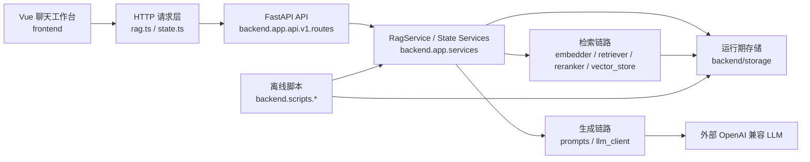

# project_X 项目架构与维护说明

> 文档定位：当前版本的维护交接文档  
> 适用对象：项目后续开发者、维护者、联调人员  
> 当前基线：`backend/` + `frontend/` + `docs/` 的 Ver 2.0 结构  
> 历史文档：`docs/versions/ver1.0/`、`docs/versions/ver2.0/`

## 1. 文档目的与阅读方式

本项目当前是一套基于检索增强生成（RAG）的智能问答、文本摘要和知识检索系统。它已经完成从旧版单体实验结构到前后端分离结构的重构，当前正式运行主体为：

- `backend/`：FastAPI 后端、离线脚本、运行期存储、测试
- `frontend/`：Vue 3 + Vite 聊天式工作台前端
- `docs/`：历史方案、课程文档与当前维护文档

这份文档的重点不是“展示成果”，而是帮助后来者快速理解：

- 项目现在是怎么跑起来的
- 前后端各自负责什么
- 真正的核心逻辑在哪一层
- 改需求时应该从哪里下手
- 哪些边界和约束不要轻易打破

推荐阅读顺序如下：

1. 先看“项目总览”，建立整体心智模型
2. 再看“后端架构”，理解 RAG 服务链路和脚本链路
3. 再看“前端架构”，理解聊天工作台、状态管理和接口消费方式
4. 最后看“维护约束与后续建议”，避免后续开发重新走回旧结构

需要特别说明的是：

- `docs/versions/ver1.0/` 和 `docs/versions/ver2.0/` 是历史设计与重构资料，不是当前运行入口说明
- 当前真实结构、接口与运行方式，以仓库中的 `backend/`、`frontend/` 代码为准

## 2. 项目总览

### 2.1 项目定位

本项目当前承接 3 条主能力链路：

- `QA`：基于本地知识索引和外部大模型的智能问答
- `Summary`：对长文本进行摘要压缩
- `Search`：直接返回检索到的参考片段，便于检查检索质量

从工程角度看，它不是单纯的“调用 LLM”，而是把以下能力串联起来：

- 原始数据采集与补充
- 文本清洗与分块
- 向量化与 FAISS 索引构建
- 查询检索与可选重排
- Prompt 构造与 OpenAI 兼容 LLM 调用
- 评估报告生成
- 前端聊天式工作台交互

### 2.2 总体架构图



### 2.3 当前骨架说明

| 区域 | 关键路径 | 作用 |
| --- | --- | --- |
| 后端服务入口 | `backend/main.py` | 创建 FastAPI 应用、注册路由、统一异常处理、启动预热 |
| 后端 API | `backend/app/api/v1/routes/` | 暴露 `health`、`rag`、`datasets`、`index`、`evaluations` 接口 |
| 后端服务层 | `backend/app/services/` | 编排问答、检索、摘要、数据状态、索引状态、评估状态 |
| RAG 核心模块 | `backend/app/rag/` | 承担数据处理、向量化、检索、Prompt、LLM、评估等能力 |
| 批处理脚本 | `backend/scripts/` | 负责 `collect -> clean -> chunk -> build_index -> run_evaluation` |
| 运行期产物 | `backend/storage/` | 存放原始数据、分块结果、索引、评估报告 |
| 前端入口 | `frontend/src/main.ts` | 挂载 Vue 应用与路由 |
| 前端工作台 | `frontend/src/views/WorkspaceView.vue` | 单工作台聊天界面，承载 QA / Summary / Search |
| 前端状态 | `frontend/src/stores/` | 管理应用标题与本地会话持久化 |
| 文档 | `docs/` | 当前维护文档、历史重构文档、课程设计文档 |

### 2.4 运行入口

| 用途 | 命令 / 地址 | 说明 |
| --- | --- | --- |
| 后端命令行启动 | `uvicorn backend.main:app --host 127.0.0.1 --port 8050` | 正式后端运行方式 |
| 后端直跑 | `python backend/main.py` | 便于在 VSCode 中按文件直接启动 |
| 前端启动 | `cd frontend && npm run dev -- --host 127.0.0.1 --port 3001` | 主要人工交互入口 |
| 接口调试入口 | `http://127.0.0.1:8050/docs` | 保留给接口调试和联调，不是主要人工使用入口 |
| 前端主入口 | `http://127.0.0.1:3001` | 当前主要交互入口 |
| 数据采集脚本 | `python -m backend.scripts.collect_data` | 采集和补充数据 |
| 数据清洗脚本 | `python -m backend.scripts.clean_data` | 清洗并原地覆盖原始文档 |
| 数据分块脚本 | `python -m backend.scripts.chunk_data` | 生成 `chunks.json` |
| 建索引脚本 | `python -m backend.scripts.build_index` | 构建 `faiss.index` 与 `chunk_meta.json` |
| 评估脚本 | `python -m backend.scripts.run_evaluation` | 生成自动评估和人工评估报告 |

## 3. 后端架构

### 3.1 FastAPI 壳层

#### 职责

后端应用壳层由 `backend/main.py` 负责，主要完成：

- 创建 FastAPI 应用实例
- 注册 CORS 中间件
- 统一业务异常、参数校验异常和兜底异常处理
- 挂载 API v1 路由
- 在启动阶段按配置预热 RAG 检索链路
- 提供 `python backend/main.py` 的直接运行入口

#### 逻辑

后端启动的核心流程可以概括为：

1. 读取 `backend/.env`
2. 创建 `settings`
3. 组装 FastAPI 实例
4. 注册统一响应与异常处理
5. 注册 `api/v1` 路由
6. 依据 `PREWARM_RAG_ON_STARTUP` 决定是否进行检索链路预热

需要注意：

- 预热只覆盖索引加载、嵌入器和重排器初始化，不主动调用外部 LLM
- 这样做的目的是把首问冷启动成本前移，但不让外部 LLM 网络问题阻塞整个服务启动

#### 维护入口

通常从这里下手：

- 改服务启动行为：`backend/main.py`
- 改全局异常包络：`backend/app/core/response.py`、`backend/app/core/exceptions.py`
- 改配置加载：`backend/app/core/config.py`

#### 约束

- 不要把业务逻辑写回 `main.py`
- 路由注册和全局异常处理可以放在壳层，实际业务编排必须下沉到 `services/`
- 如果未来改启动生命周期，优先保留“预热检索、不预热 LLM”的设计原则

### 3.2 API 层

#### 职责

API 层位于 `backend/app/api/v1/routes/`，负责：

- 接收 HTTP 请求
- 依赖注入对应 service
- 交给 service 层执行
- 使用统一响应包络返回结果

当前 API 列表如下：

| 方法 | 路径 | 作用 |
| --- | --- | --- |
| `GET` | `/api/v1/health` | 检查服务与索引文件基本状态 |
| `POST` | `/api/v1/rag/qa` | 执行问答 |
| `POST` | `/api/v1/rag/summary` | 执行摘要 |
| `POST` | `/api/v1/rag/search` | 执行检索 |
| `GET` | `/api/v1/datasets/stats` | 返回数据集统计 |
| `GET` | `/api/v1/index/status` | 返回索引状态 |
| `GET` | `/api/v1/evaluations/latest` | 返回最新评估报告内容 |

#### 统一响应口径

所有正常返回都必须保持以下结构：

```json
{
  "code": 0,
  "message": "ok",
  "data": {}
}
```

错误返回也必须保持同一包络：

```json
{
  "code": 422,
  "message": "请求参数校验失败",
  "data": []
}
```

这层统一性对前端和联调都很重要，后续不要破坏。

#### 参数校验边界

当前校验规则来自 `backend/app/schemas/rag.py`，后续改接口时必须保持口径一致：

- `question` / `text`：`trim()` 后不能为空
- `top_k`：整数，范围 `1..10`
- `temperature`：浮点数，范围 `0..1.5`

如果未来前端交互变化，前端本地校验也必须和这里同步更新。

#### 维护入口

通常从这里下手：

- 增加或修改接口：`backend/app/api/v1/routes/`
- 修改请求体字段：`backend/app/schemas/rag.py`
- 调整返回数据结构：优先改 service，再由 route 包装输出

#### 约束

- Route 层应保持“薄路由”，不要把核心业务逻辑塞进函数体
- 新接口如果本质上是读状态或读结果，应尽量复用现有 `services/`
- 长耗时动作当前优先走脚本，不要轻易补成重操作 HTTP API

### 3.3 服务编排层

#### 职责

服务编排层位于 `backend/app/services/`，其中最核心的是 `RagService`。它负责统一封装：

- 索引加载与变更感知
- 嵌入器、检索器、重排器、Prompt、LLM 的懒加载
- Search / QA / Summary 三条主链路
- QA 性能裁剪逻辑
- 阶段耗时日志

此外还有：

- `DatasetService`：数据准备与统计
- `IndexService`：索引构建与索引状态
- `EvaluationService`：评估执行与报告读取

#### QA / Search / Summary 内部逻辑

`Search` 主链路：

1. 检查并加载索引
2. 编码 query
3. 向量检索
4. 可选重排
5. 构造 `references`

`QA` 主链路：

1. 执行和 Search 相同的检索链路
2. 裁剪出供 LLM 使用的上下文
3. 根据模式构造 Prompt
4. 调用 OpenAI 兼容 LLM
5. 返回 `answer + references`

`Summary` 主链路：

1. 不依赖向量检索
2. 对短文本直接走摘要 Prompt
3. 对长文本走分段摘要逻辑
4. 返回 `summary`

#### QA 的速度优先策略

这一版服务层已经显式做了“速度优先”设计：

- `MODEL_LOCAL_ONLY=true`
- `PREWARM_RAG_ON_STARTUP=true`
- `RERANK_ENABLED=false`
- `QA_CONTEXT_TOP_K=3`
- `QA_CONTEXT_MAX_CHARS=1600`
- `QA_MAX_TOKENS=512`
- `OPENAI_TIMEOUT=20`
- `OPENAI_RETRIES=1`

设计意图如下：

- 先把本地索引和本地模型路径预热好，避免首问卡在远程探测上
- QA 返回完整 `references`，但只把裁剪后的部分上下文注入给 LLM
- 允许一定精度折中，以换取更可接受的交互响应速度

#### 维护入口

通常从这里下手：

- 改问答主逻辑：`backend/app/services/rag_service.py`
- 改数据链路：`backend/app/services/dataset_service.py`
- 改索引构建行为：`backend/app/services/index_service.py`
- 改评估流程：`backend/app/services/evaluation_service.py`

#### 约束

- 不要在 route 层直接操作 `embedder`、`vector_store`、`llm_client`
- 如果要新增新的 RAG 模式，优先在 `RagService` 里扩展，而不是散落多个地方
- 阶段耗时日志建议保留，它是后续定位性能问题的重要依据

### 3.4 RAG 子模块

#### 职责分工

`backend/app/rag/` 当前按能力拆成 5 组模块：

| 子目录 | 作用 |
| --- | --- |
| `data/` | 数据采集、清洗、分块、补充、JSON I/O、数据模型 |
| `indexing/` | 文本嵌入、向量库加载与保存 |
| `retrieval/` | 查询编码、向量检索、可选重排 |
| `generation/` | Prompt 模板、LLM 客户端 |
| `evaluation/` | 自动评估与人工评估 |

当前关键模块职责如下：

- `embedder.py`：本地优先加载 BGE 模型；本地模型缺失时快速退化到哈希向量
- `vector_store.py`：封装 FAISS 索引读写和检索接口
- `retriever.py`：把 query 编码与向量检索拼起来，并还原为 `SearchResult`
- `reranker.py`：在启用时执行重排
- `prompts.py`：按 QA / Summary 等模式构造 Prompt
- `llm_client.py`：调用 OpenAI 兼容接口，统一超时与重试

#### 维护入口

通常从这里下手：

- 改检索质量：`indexing/` + `retrieval/`
- 改回答风格：`generation/prompts.py`
- 改模型供应商接入：`generation/llm_client.py`
- 改数据源：`backend/app/rag/data/collector.py`、`backend/app/rag/data/supplement.py`

#### 约束

- 底层模块尽量保持“单一职责”，不要把服务编排逻辑再反向塞回模块里
- `embedder` 的本地优先 fallback 机制不要随意去掉，否则首问性能很容易再次恶化
- `SearchResult` 当前只稳定暴露 `chunk_id / doc_id / content / score`，不要假设一定有文档标题或来源字段

### 3.5 数据与脚本链路

#### 职责

离线数据链路不通过 HTTP 触发，而是通过 `backend/scripts/` 下的脚本串起来。这是当前项目“在线服务”和“长耗时批处理”分离的重要边界。

#### 执行顺序

推荐顺序固定为：

```text
collect_data -> clean_data -> chunk_data -> build_index -> run_evaluation
```

各脚本职责如下：

| 脚本 | 主要输入 | 主要输出 | 说明 |
| --- | --- | --- | --- |
| `collect_data` | `.env` 配置、`materials/` | `raw/documents.json`、`raw/qa_pairs.json` | 汇总 arXiv、新闻、课程资料、自建 QA，并在不足时补充内容 |
| `clean_data` | `raw/documents.json` | 原地覆盖 `raw/documents.json` | 清洗、去重、过滤过短文本 |
| `chunk_data` | `raw/documents.json` | `processed/chunks.json` | 按配置分块 |
| `build_index` | `processed/chunks.json` | `index/faiss.index`、`index/chunk_meta.json` | 构建向量索引 |
| `run_evaluation` | 索引、RAG 服务 | `eval/auto_eval_report.txt`、`eval/human_scores.json`、`eval/human_eval_report.txt` | 生成评估结果 |

#### 当前数据来源

当前数据准备链路主要使用：

- arXiv 文献
- 新闻文本
- 本地课程资料
- 自建 QA
- 当数据量不足时的补充文档

#### 维护入口

通常从这里下手：

- 改脚本入口：`backend/scripts/*.py`
- 改批处理逻辑：对应 `backend/app/services/*_service.py`
- 改原始数据模型：`backend/app/rag/data/models.py`

#### 约束

- 当前设计明确区分“脚本做重活，API 做在线服务”，不要轻易混回一体
- `clean_data` 当前会原地覆盖 `raw/documents.json`，修改行为时要特别小心
- 不建议手工改 `chunks.json`、`chunk_meta.json`、`faiss.index`，这些都应由脚本生成

### 3.6 配置与存储

#### 配置策略

当前后端只有一个正式配置入口：`backend/.env`。

它的读取逻辑位于 `backend/app/core/config.py`，并由 `settings` 对象统一提供给整个后端使用。当前已明确不再兼容旧版 YAML 配置。

关键配置分组如下：

- 应用基础配置：`APP_NAME`、`APP_HOST`、`APP_PORT`、`ALLOWED_ORIGINS`
- LLM 配置：`OPENAI_API_KEY`、`OPENAI_BASE_URL`、`OPENAI_MODEL`、`OPENAI_TIMEOUT`、`OPENAI_RETRIES`
- 检索性能配置：`MODEL_LOCAL_ONLY`、`PREWARM_RAG_ON_STARTUP`、`RERANK_ENABLED`、`QA_CONTEXT_TOP_K`、`QA_CONTEXT_MAX_CHARS`、`QA_MAX_TOKENS`
- 数据脚本配置：`ARXIV_*`、`NEWS_MAX_ARTICLES`、`QA_MIN_PAIRS`、`CHUNK_*`
- 存储根目录：`STORAGE_DIR`

#### 存储结构

运行期数据固定落在 `backend/storage/` 下：

| 目录 | 作用 |
| --- | --- |
| `raw/` | 原始文档与 QA 数据 |
| `processed/` | 分块后的中间产物 |
| `index/` | FAISS 索引和检索元数据 |
| `eval/` | 自动评估与人工评估报告 |
| `materials/` | 本地课程资料等补充输入 |

#### 维护入口

通常从这里下手：

- 改默认配置：`backend/.env.example`
- 改配置解析：`backend/app/core/config.py`
- 改产物路径：优先在 `Settings` 的路径属性里调整

#### 约束

- `backend/.env` 是唯一配置入口，不要再恢复 YAML 或第二套配置源
- `backend/storage/` 是唯一运行期数据根目录，不要再恢复根目录 `data/` 结构
- 如果未来需要新增配置项，必须同时补到 `.env.example`，避免文档与实际行为脱节

## 4. 前端架构

### 4.1 路由结构

#### 职责

前端当前不是三套独立页面，而是“单视图多入口”结构。路由定义位于 `frontend/src/router/index.ts`，统一指向 `WorkspaceView.vue`。

当前公开路由为：

- `/`
- `/qa`
- `/summary`
- `/search`

它们的真实区别不是页面不同，而是 `meta.defaultMode` 不同：

- `/` 和 `/qa` 默认进入 `qa`
- `/summary` 默认进入 `summary`
- `/search` 默认进入 `search`

#### 逻辑

也就是说，当前前端主入口已经不是“首页 + 三个工具页”，而是一个聊天式工作台。路由只是提供：

- 可收藏链接
- 可直达指定模式
- 与 README、历史访问习惯兼容

#### 维护入口

通常从这里下手：

- 改路由行为：`frontend/src/router/index.ts`
- 改模式切换和 URL 同步：`frontend/src/views/WorkspaceView.vue`

#### 约束

- 不要把 `/qa`、`/summary`、`/search` 再拆回三套独立实现
- 新增模式时，先确认是否真的需要新路由，避免把单工作台重新复杂化

### 4.2 页面骨架

#### 职责

当前前端主页面是三栏工作台：

- 左侧：会话栏
- 中间：聊天区与输入区
- 右侧：系统状态卡与当前结果详情

移动端会收敛成单列布局：

- 会话栏可折叠
- 信息栏下移
- 输入区仍保留可用性

#### 逻辑

页面结构和视觉主要落在：

- `frontend/src/views/WorkspaceView.vue`
- `frontend/src/assets/main.css`

具体交互包括：

- 左侧可新建、切换、删除本地会话
- 中间可在同一会话中混合发送 QA / Summary / Search 消息
- 右侧自动跟随当前会话最新 assistant 消息显示结果详情
- 状态卡会并行读取健康、索引、数据集状态接口

#### 维护入口

通常从这里下手：

- 改三栏布局与样式：`frontend/src/assets/main.css`
- 改工作台交互：`frontend/src/views/WorkspaceView.vue`
- 改引用片段展示：`frontend/src/components/ReferenceList.vue`

#### 约束

- 保持“聊天工作台”这一主交互模型，不要退回表单页思路
- 右侧详情栏默认跟随最新 assistant 消息，本轮不支持手动点选旧消息回看详情
- `/docs` 是调试入口，不再应在前端文案里被当作主要人工入口

### 4.3 状态管理

#### 职责

前端状态管理目前非常轻量，没有引入复杂全局状态库，核心逻辑集中在：

- `frontend/src/stores/app.ts`：应用标题等轻量常量
- `frontend/src/stores/chatWorkspace.ts`：本地会话工作台状态

`chatWorkspace` 负责：

- 当前会话与会话列表
- 当前模式
- 本地持久化
- 创建会话、删除会话、追加消息、更新消息

#### 逻辑

当前会话模型具有以下规则：

- 一个会话可以混合 `qa`、`summary`、`search` 三种消息
- 标题自动取第一条用户消息的前一小段文本
- 最多保留最近 20 个会话
- 会话历史只保存在浏览器 `localStorage`
- 页面刷新后可以恢复本地会话

#### 维护入口

通常从这里下手：

- 改会话上限、本地存储键：`frontend/src/stores/chatWorkspace.ts`
- 改消息元数据结构：`frontend/src/types/chat.ts`

#### 约束

- 当前不是后端会话记忆系统，不要误以为消息已持久化到服务端
- 如果未来引入数据库或账号系统，需要明确做一轮“前端本地会话 -> 服务端会话”的架构升级，而不是在现有 store 上临时拼补

### 4.4 API 交互

#### 职责

前端 API 层位于 `frontend/src/api/`，主要拆成两组：

- `rag.ts`：请求 `qa`、`summary`、`search`
- `state.ts`：请求 `health`、`index/status`、`datasets/stats`

底层请求封装位于 `http.ts`，负责：

- 统一拼接 `VITE_API_BASE_URL`
- 统一设置 `Content-Type`
- 统一解析 JSON 包络
- 在后端返回 4xx/5xx 或非法 JSON 时抛出可读错误

#### 逻辑

当前前端请求默认指向：

```text
http://127.0.0.1:8050/api/v1
```

如有需要，可通过 `VITE_API_BASE_URL` 覆盖。

类型定义位于 `frontend/src/types/api.ts`，它和后端统一响应结构必须保持同步。

#### 维护入口

通常从这里下手：

- 改请求基地址：`frontend/src/api/http.ts`
- 改接口类型：`frontend/src/types/api.ts`
- 改请求封装：`frontend/src/api/http.ts`

#### 约束

- 前端必须继续消费统一响应包络，不能绕开 `code / message / data`
- 如果后端接口字段变了，前端类型和工作台渲染逻辑必须同步更新
- `getErrorMessage()` 当前会优先展示后端 message，尽量保留这一点，避免只向用户抛出无意义的浏览器原始异常

### 4.5 用户交互规则

#### 当前规则

当前工作台已固定以下交互约束：

- `Enter` 发送
- `Shift + Enter` 换行
- 本地参数校验失败时，只在输入区内联提示，不进入消息流
- 用户发送后，先立即追加用户消息，再追加一个 assistant loading 消息
- 接口失败时，错误以 assistant 气泡形式落在消息流中
- Summary 模式右侧只展示长度统计，不展示 references
- QA / Search 模式右侧展示 references

#### 维护入口

通常从这里下手：

- 改输入规则：`frontend/src/views/WorkspaceView.vue`
- 改错误文本展示：`frontend/src/api/error.ts`

#### 约束

- 不要把错误重新做成弹窗主导交互，当前消息流错误反馈更符合聊天工作台模型
- 前端本地校验边界必须和后端 schema 保持一致

## 5. 维护约束与常见修改入口

### 5.1 常见修改入口表

| 需求 | 推荐入口 | 说明 |
| --- | --- | --- |
| 改 QA 的回答上下文策略 | `backend/app/services/rag_service.py` | 包括 `QA_CONTEXT_TOP_K`、`QA_CONTEXT_MAX_CHARS`、上下文裁剪逻辑 |
| 改 QA / Summary 的 Prompt | `backend/app/rag/generation/prompts.py` | 不建议直接在 route 里拼 prompt |
| 改 LLM 模型、超时、重试 | `backend/.env`、`backend/app/core/config.py`、`backend/app/rag/generation/llm_client.py` | 先改配置，再看是否要改客户端逻辑 |
| 改索引构建策略 | `backend/app/services/index_service.py`、`backend/app/rag/indexing/` | 构建脚本只是入口，核心逻辑在 service 和 indexing |
| 改数据采集来源 | `backend/app/rag/data/collector.py`、`backend/app/rag/data/supplement.py` | 注意不要破坏后续清洗与分块链路 |
| 改会话持久化规则 | `frontend/src/stores/chatWorkspace.ts` | 包括本地存储键、上限数量、标题生成逻辑 |
| 改聊天工作台布局 | `frontend/src/views/WorkspaceView.vue`、`frontend/src/assets/main.css` | 当前是单工作台三栏结构 |
| 改状态卡展示 | `frontend/src/api/state.ts`、`frontend/src/views/WorkspaceView.vue`、对应后端 state service | 前后端要一起看 |
| 改引用片段卡片样式 | `frontend/src/components/ReferenceList.vue`、`frontend/src/assets/main.css` | 只动样式时尽量不改接口结构 |
| 改统一返回结构 | `backend/app/core/response.py` + 前端 `types/api.ts` + `http.ts` | 这是高影响改动，必须前后端同步 |

### 5.2 后续开发的基本约束

后续开发建议始终遵守以下规则：

1. 不要恢复旧版根目录结构，不要再把业务代码和运行数据塞回根目录。
2. 不要新增第二套配置源，`backend/.env` 是正式入口。
3. 不要破坏统一响应包络，前端已经默认依赖 `{ code, message, data }`。
4. 不要绕过 `RagService` 直接让 route 去操作底层模块。
5. 不要把 `/qa`、`/summary`、`/search` 重新演化成三套互相复制的前端页面。
6. 不要把重型批处理直接塞成在线 HTTP 操作，当前默认通过脚本执行。
7. 不要在没有明确设计的情况下，把本地会话误当作服务端持久会话。

### 5.3 当前已知局限

当前版本仍然有这些明确边界：

- 没有数据库
- 没有鉴权
- 没有任务队列
- 没有流式输出
- 没有知识图谱
- 没有服务端多轮会话记忆
- 前端会话只做本地持久化
- `evaluations/latest` 是读结果接口，不是全套评估平台

这些都不是 bug，而是当前架构阶段性选择。后续如果要补，需要作为明确的演进项设计。

### 5.4 推荐的日常验证方式

做改动后，建议至少按以下方式回归：

后端：

```powershell
pytest backend/tests -q
python backend/main.py
```

前端：

```powershell
cd frontend
npm run build
npm run dev -- --host 127.0.0.1 --port 3001
```

联调检查：

- `/api/v1/health`
- `/api/v1/rag/qa`
- `/api/v1/rag/summary`
- `/api/v1/rag/search`
- `/api/v1/datasets/stats`
- `/api/v1/index/status`
- 前端 `/`、`/qa`、`/summary`、`/search`

## 6. 后续优化建议

### 6.1 建议优先级较高的方向

1. 流式输出  
   现在 QA 和 Summary 都是整段返回，后续可以考虑 SSE 或 WebSocket，让聊天体验更自然。

2. 重操作后台任务化  
   `build_index`、`run_evaluation` 仍然是脚本优先。如果未来要上 Web 触发，建议配任务队列或后台任务系统，不要直接用同步 HTTP 顶上。

3. 更完整的评测链路  
   当前评估已经有自动评估和人工评估文件输出，但还不是可持续迭代的评测平台。后续可以补更多样本管理、报告结构化和对比能力。

4. 更细粒度的前端详情视图  
   当前右侧详情栏默认只跟随最新 assistant 消息。后续可以增加“点选某条消息回看详情”的能力，但需要注意不要破坏现有工作台简洁性。

5. 状态监控与日志观测  
   当前已有部分性能日志，后续可以继续补充更稳定的结构化日志、接口耗时统计与错误监控。

### 6.2 不建议立即做的方向

以下方向现在不建议抢先做：

- 为了“看起来完整”而先引入数据库
- 为了“像聊天产品”而先做复杂账号体系
- 为了“前端页面更多”而把单工作台拆成一堆重复页面
- 在没有清晰调度设计时，把所有脚本都改成 HTTP 接口

当前更重要的是继续守住现有结构边界，让后端服务层、前端工作台、离线脚本和运行期存储各自职责稳定。

## 7. 总结

当前的 project_X 已经从“旧版单体实验结构”收敛为一套更清晰的前后端分离工程：

- 后端负责 API、RAG 编排、数据脚本和运行期存储
- 前端负责聊天式工作台交互和状态展示
- 文档层负责沉淀历史方案与当前维护说明

后续维护时，最重要的不是继续“堆功能”，而是保持以下几条主线不被打散：

- 后端壳层薄、服务层厚、底层模块职责单一
- 前端坚持单工作台交互，不回退到多套重复页面
- 配置只走 `.env`，数据只走 `backend/storage/`
- 批处理和在线服务保持分层

只要这几个边界守住，后续无论是继续补功能、做性能优化，还是继续产品化演进，都会轻松很多。
